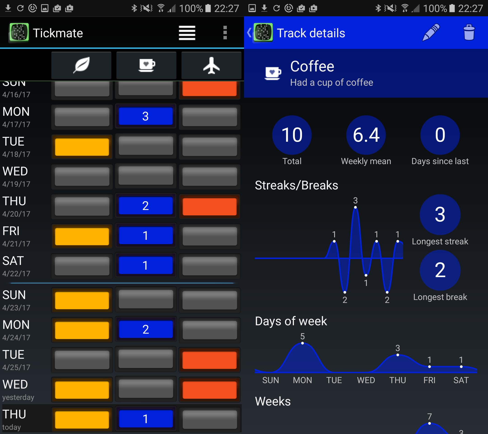

# Tickmate

### About

Tickmate is basically a one bit journal. For each day, you can specify whether something has occurred or not. The occurrences can be arbitrary things, like flossing your teeth or having a drink. You are able to quantify your habits and the accumulated data can be displayed for the past weeks or months to track changes over time. This way, it may help you to get over your old habits or embody new ones.

Tickmate is an Android App and is available from the [Play Store](https://play.google.com/store/apps/details?id=de.smasi.tickmate) and [F-Droid](https://f-droid.org/repository/browse/?fdid=de.smasi.tickmate).

### Features

* Choose name, icon and color per track
* Analytics like streaks, breaks, day of week distribution, histograms
* Track groups
* Daily reminder notification
* Export database for backup and further analysis

See the [change log](CHANGES.md) for the recent changes.

### Screenshots

### Analysis

These section contains development ideas for the analysis of Tickmate data. In
future, those ideas might be integrated into the app or available as a Web
service.

Plot multiple tracks:

Find correlations between your tracks:

### Notes

Contains icons from the [Glyphicons FREE icon set](http://glyphicons.com/) (CC-BY-3.0)

### Donations

Bitcoin (BTC): [18tub3juj26zyGwdpmGDLgtLEpfFf2Nvhu](https://blockchain.info/address/18tub3juj26zyGwdpmGDLgtLEpfFf2Nvhu)

Bitcoin Cash (BCH): [bitcoincash:qza9pl6udy30whn5ux3uw4egrcmckdj6gucpjqa44d](bitcoincash:qza9pl6udy30whn5ux3uw4egrcmckdj6gucpjqa44d)

Ethereum (ETH): [0x4c3cbbeed535b05e9cbe4c32616f7798869298e2](https://etherscan.io/address/0x4c3cbbeed535b05e9cbe4c32616f7798869298e2)

[Translations](LOCALIZATION.md) are gratefully accepted as well.
